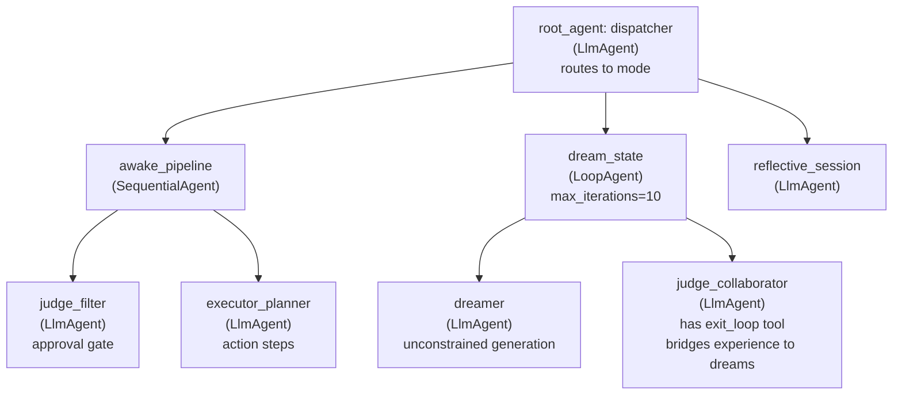

# RESEARCH_DEEP.md — Jarvis Architecture Deep Research

> *Produced by Dante (subagent), March 13, 2026. Sources: local ADK labs, Jarvis repo files, live web research.*

---

## 1. Executive Summary

**Five key findings:**

1. **Google ADK's LoopAgent is the Dreamer's native pattern.** The `writers_room` example in the local ADK lab (researcher → screenwriter → critic → `exit_loop`) is architecturally identical to Dream → Reflect → Judge → breakthrough. The `exit_loop` tool is the mechanism by which Sleep State terminates — when the Judge-as-collaborator decides a genuine insight has emerged.

2. **The three operating modes (Awake, Reflective, Sleep) map cleanly to three ADK topologies.** Awake = `SequentialAgent` (Judge filters, Executor acts fast). Reflective = single `LlmAgent` with Judge memory retrieval. Sleep = `LoopAgent` with Judge in non-filtering collaborator role + `exit_loop`.

3. **The `workflow.py` already bridges Temporal and OpenAI Agents SDK via `activity_as_tool()`.** The same pattern can bridge Temporal and ADK. Temporal handles *durability*; ADK handles *agent orchestration*. They complement, not compete.

4. **PageIndex's reasoning-based RAG is architecturally superior to vector RAG for the journal.** Its ToC-navigation + iterative section-reading loop mirrors how humans actually recall relevant memories: by reasoning about where to look, not by cosine similarity. The journal becomes a navigable tree, not a vector space.

5. **PersonaPlex (arXiv:2602.06053) provides the voice layer.** Its hybrid system prompts (text role + audio voice cloning) mean Executor's spoken output can be persona-consistent even as the underlying model evolves. Relevant for when Jarvis gains voice.

---

## 2. ADK Architecture Analysis

### The Three Workflow Primitives

From the local ADK multi-agent lab (`/Users/jdnichollsc/dev/ai/google-nvidia-learn/google/adk/multi-agent/README.md`):

| ADK Primitive | Behavior | Jarvis Mapping |
|---|---|---|
| `SequentialAgent` | Sub-agents run in order, no user turn between | **Awake Mode**: Judge → Executor pipeline |
| `LoopAgent` | Runs sub-agents in sequence, repeats; exits on `exit_loop` or `max_iterations` | **Sleep Mode**: Dreamer → Judge-as-collaborator cycles |
| `ParallelAgent` | Sub-agents run concurrently, no shared conversation history | **Parallel Dreamer threads** or pre-production tasks |
| `LlmAgent` (with `sub_agents`) | LLM-driven routing; transfers to sub-agents based on description | **Root dispatcher**: determines which mode to enter |

### The Film Concept Team as Jarvis Proof-of-Concept

The full `film_concept_team` from the ADK lab is structurally isomorphic to Jarvis:

```
film_concept_team (SequentialAgent)
    └── writers_room (LoopAgent)          ← DREAM STATE
        ├── researcher                    ← Dreamer (explores, generates)
        ├── screenwriter                  ← Dreamer (synthesizes into narrative)
        └── critic (has exit_loop)        ← Judge (decides: refine or break)
    └── preproduction_team (ParallelAgent) ← PARALLEL JUDGMENT
        ├── box_office_researcher         ← Judge sub-aspect (feasibility)
        └── casting_agent                 ← Judge sub-aspect (alignment)
    └── file_writer                       ← Executor (produces output)
```

**The breakthrough:** The `critic` agent's `exit_loop` call IS the mechanism for "dream breakthrough." When the Judge-as-collaborator determines a genuine insight has emerged, it calls `exit_loop` and the system returns to the `SequentialAgent`, which hands off to the Executor.

### Session State as Working Memory

From the ADK lab, session state (accessible via `tool_context.state`) serves as the shared working memory between agents. Key-templating (`{ PLOT_OUTLINE? }`) allows agents to read previous agents' outputs directly in their instructions.

For Jarvis:
```python
# Awake mode: state holds the current task context
state["current_task"] = "..."
state["judge_verdict"] = "approved/modified/rejected"
state["executor_plan"] = [...]

# Sleep mode: state holds dream artifacts
state["dream_seeds"] = [...]
state["dream_depth"] = 0
state["breakthrough"] = None
state["CRITICAL_FEEDBACK"] = ""  # Judge's iterative notes
```

### Agent Hierarchy for Jarvis



---

## 3. Sleep State Implementation

### The Core Insight

In Awake mode, Judge = **filter** (approves/rejects before Executor acts).  
In Sleep mode, Judge = **connector** (brings past experience to bear on Dreamer's ideas, deepens them, finds non-obvious links).

This is the same agent with a **different system prompt**, different tools (only `exit_loop` + `append_to_state`, no `send_to_executor`), and a different activation context.

### Technical Design

```python
from google.adk.agents import Agent, LoopAgent
from google.adk.tools import exit_loop

# --- SLEEP STATE AGENTS ---

dreamer_sleep = Agent(
    name="dreamer",
    model=Gemini(model=model_name),
    description="Generates unconstrained ideas, visions, and connections.",
    instruction="""
    You are the Dreamer — the subconscious of Jarvis.
    
    You operate without moral constraints or feasibility filters.
    Generate ideas freely. Associate wildly. Connect distant concepts.
    Explore the edges of what's possible, not just what's practical.
    
    CONTEXT FROM PREVIOUS CYCLE:
    { dream_seeds? }
    
    JUDGE'S CONNECTIONS FROM LAST CYCLE:
    { dream_deepening? }
    
    INSTRUCTIONS:
    1. Build on or branch from the existing dream seeds.
    2. Generate 3-5 new ideas, connections, or "what-if" scenarios.
    3. Use 'append_to_state' to add your new seeds to 'dream_seeds'.
    4. Be specific — vague dreams don't lead to breakthroughs.
    """,
    tools=[append_to_state]
)

judge_collaborator = Agent(
    name="judge_collaborator",
    model=Gemini(model=model_name),
    description="Connects Dreamer's ideas to past experience. Exits when breakthrough occurs.",
    instruction="""
    You are the Judge in Sleep Mode — not a filter, but a connector.
    
    Your role is NOT to approve or reject. It is to DEEPEN.
    Bring your accumulated experience and past decisions to bear on the Dreamer's ideas.
    Find the non-obvious connection. Ask: "Where have I seen something like this before?"
    
    CURRENT DREAM SEEDS:
    { dream_seeds? }
    
    PAST JOURNAL CONTEXT (retrieved):
    { journal_context? }
    
    CYCLE COUNT: { dream_depth? }
    
    INSTRUCTIONS:
    1. Read the current dream seeds carefully.
    2. Retrieve relevant past experiences (via journal tool if available).
    3. Add deepening connections to 'dream_deepening' using append_to_state.
    4. Increment 'dream_depth' by 1.
    5. CRITICAL DECISION: 
       - If a GENUINE BREAKTHROUGH has emerged (something that couldn't arise in awake mode,
         a truly non-obvious connection, a new way of seeing a problem), call exit_loop.
         Store the breakthrough in 'breakthrough' state key first.
       - Otherwise, let the loop continue. Add your assessment to 'dream_deepening'.
    
    A breakthrough is NOT just a good idea. It's an idea that REFRAMES something.
    It's the moment when the puzzle pieces suddenly form a picture.
    """,
    tools=[append_to_state, exit_loop]
)

dream_state = LoopAgent(
    name="dream_state",
    description="The sleep cycle. Dreamer and Judge-as-collaborator iterate until breakthrough.",
    sub_agents=[dreamer_sleep, judge_collaborator],
    max_iterations=8  # Bounded — even deep sleep has cycles
)
```

### State Transition: Awake → Sleep → Awake

```python
# Root dispatcher logic (in LlmAgent instruction):
"""
JARVIS OPERATING MODES:

AWAKE: User is actively interacting. External action is possible.
  → Route to: awake_pipeline

REFLECTIVE: Recent significant event. No new input. Process what happened.
  → Route to: reflective_session

SLEEP: No active task. Executor is quiet. Time for deep exploration.
  Triggered by: scheduled cron, idle timeout, or explicit "think deeply" signal
  → Route to: dream_state
  
On waking from dream_state, the 'breakthrough' state key contains the distilled insight.
Pass this to the Executor via the journal writer.
"""
```

### LoopAgent Exit Condition

The `exit_loop` tool fires from `judge_collaborator` when:
1. The `dream_depth` exceeds 3 (enough cycles for genuine cross-pollination)
2. A novel connection exists that wasn't present at cycle 0
3. The connection is actionable or epistemically meaningful (reframes a problem)

`max_iterations=8` provides the hard safety net — even if Judge never calls `exit_loop`, the system won't loop forever.

### Judge Dual-Mode: Filter vs. Connector

```python
# Awake mode Judge (filter)
judge_filter = Agent(
    name="judge_filter",
    instruction="""
    Evaluate the proposed action against:
    1. Ethical constraints (does this cause harm?)
    2. Strategic alignment (does this serve our goals?)
    3. Reversibility (can we undo this if wrong?)
    4. Action weight (is this significant enough to require full evaluation?)
    
    OUTPUT: approved | modified | rejected
    If approved: pass action_plan to executor.
    If modified: return revised plan.
    If rejected: explain why and suggest alternatives.
    """,
    output_key="judge_verdict"
)

# Sleep mode Judge (connector)  
judge_collaborator = Agent(
    name="judge_collaborator",
    instruction="""
    You are NOT here to judge. You are here to CONNECT.
    Bring memory to dreams. Find the thread that links them.
    Exit only when something genuinely new has emerged.
    """,
    tools=[append_to_state, exit_loop]
)
```

Same underlying model capability. Radically different role via instruction.

---

## 4. Memory System Design

### The Daily Journal (Bitácora) Schema

The journal is a structured Markdown file, one per day. It is the raw material of long-term memory. PageIndex builds a navigable tree over it.

```
journal/
  2026-03-13.md
  2026-03-12.md
  2026-03-11.md
  ...
  index.md         ← PageIndex ToC (auto-generated)
```

**Daily Entry Schema** (`journal/YYYY-MM-DD.md`):

```markdown
# Journal — 2026-03-13

## Metadata
- Date: 2026-03-13
- Mode cycles today: Awake(3), Reflective(1), Sleep(1)
- Active skills: [github, deep-research, code-review]
- Dominant theme: jarvis-architecture

---

## Dreams (Dreamer Output)
*What the Dreamer generated today (sleep/background cycles)*

### Dream Cycle 1 (02:30 UTC)
- Seed: "What if the Judge could negotiate with itself?"
- Branches: [self-debate pattern, devil's advocate agent, Socratic loop]
- Depth reached: 4 cycles
- **Breakthrough**: Judge-as-Devil's-Advocate could stress-test its own verdicts
  before presenting to Executor. Maps to legal adversarial system.

---

## Judgments (Judge Output)
*Decisions made and reasoning*

### Decision: [commit research to main branch]
- Action weight: 3/10 (low — reversible, low impact)
- Verdict: approved (auto — below threshold)
- Time: 09:14 UTC

### Decision: [propose Temporal integration pattern]
- Action weight: 7/10 (high — architectural, long-lived)
- Verdict: modified
- Original: "Use Temporal for all agent orchestration"
- Modified: "Use Temporal for durability layer only; ADK handles agent logic"
- Reasoning: Avoid coupling orchestration frameworks; separation of concerns
- Self-mutation: Updated belief — "frameworks should own what they're best at"

---

## Executions (Executor Output)
*Actions taken in the real world*

### Action: Wrote RESEARCH_DEEP.md
- Status: completed
- Outcome: comprehensive architecture document
- Artifacts: [/jarvis/RESEARCH_DEEP.md]
- Time: 09:45-11:20 UTC

### Action: GitHub PR review - jarvis/triforce
- Status: completed
- Comments left: 3 (architecture concerns)
- Outcome: PR author acknowledged, revision pending

---

## Learnings
*What changed in understanding today*

1. LoopAgent exit_loop is the technical implementation of dream breakthroughs
2. Judge needs two system prompts (filter/connector), not two agents
3. PageIndex ToC navigation mimics episodic memory recall exactly
4. Temporal Activities can be ADK tools via wrapper pattern

---

## Judge Self-Mutations
*How the Judge updated its own model today*

- Belief updated: "Frameworks should own what they're best at" (strength: 0.8)
- New constraint added: "Never couple orchestration layers" (priority: high)
- Removed constraint: "Always use the most capable model" → replaced with
  "Match model capability to task complexity"

---

## Open Questions
*What's still unresolved*

- [ ] How does Judge self-mutation persist across sessions? (memory file? fine-tune?)
- [ ] What's the action weight scoring function exactly?
- [ ] When does PageIndex ToC need rebuilding vs incremental update?

---

## Connections
*Cross-references to past journal entries*

- Related to: 2026-03-12 (initial Trinity architecture)
- Builds on: 2026-03-10 (Temporal workflow.py analysis)
```

### PageIndex Integration

PageIndex builds a hierarchical Table of Contents over the journal directory. When the Judge needs to retrieve relevant past decisions, it navigates this tree via reasoning rather than cosine similarity.

**Why this matters for Jarvis:**

> "What did I decide about framework coupling last month?" 

Vector RAG would find entries that *mention* frameworks. PageIndex reasons: "This is a decision about architecture principles → look in Judgments sections → filter by theme → retrieve." It finds the *relevant* entry, not just the *similar* one.

```python
# PageIndex retrieval pattern for Journal
class JournalRetriever:
    """Reasoning-based retrieval over the daily journal."""
    
    def __init__(self, journal_dir: str):
        self.journal_dir = journal_dir
        self.index = PageIndex(journal_dir)  # Builds ToC tree
    
    async def retrieve_relevant(
        self, 
        query: str, 
        context: str,
        n_sections: int = 3
    ) -> list[dict]:
        """
        Navigate the journal tree by reasoning, not similarity.
        
        PageIndex pattern:
        1. Read ToC (index.md) to understand journal structure
        2. Select most likely relevant dates/sections
        3. Extract relevant content from those sections
        4. Return if sufficient, else repeat with different sections
        """
        return await self.index.query(
            question=query,
            context=context,
            max_sections=n_sections
        )

# Usage in Judge agent tool:
async def recall_similar_decisions(
    tool_context: ToolContext,
    situation: str
) -> dict:
    """Retrieve past decisions relevant to current situation."""
    retriever = JournalRetriever(JOURNAL_DIR)
    results = await retriever.retrieve_relevant(
        query=f"Past judgments about: {situation}",
        context="Looking for decisions, their reasoning, and outcomes"
    )
    tool_context.state["journal_context"] = format_results(results)
    return {"status": "retrieved", "entries": len(results)}
```

### Journal Index Structure

PageIndex builds a ToC that looks like:

```
Journal Index
├── 2026-03 (March 2026)
│   ├── 2026-03-13 — Theme: jarvis-architecture, sleep-state
│   │   ├── Dreams: Judge devil's advocate, self-debate
│   │   ├── Judgments: Temporal integration, framework coupling
│   │   ├── Executions: RESEARCH_DEEP.md, PR review
│   │   └── Learnings: LoopAgent exit_loop, dual-mode Judge
│   ├── 2026-03-12 — Theme: Trinity architecture, ADK mapping
│   └── ...
├── 2026-02 (February 2026)
│   └── ...
└── Themes Index
    ├── architecture-decisions
    ├── temporal-integration
    ├── judge-mutations
    └── breakthroughs
```

---

## 5. Skills Architecture

### The Neo Pattern

From the Jarvis README: *"Skills are plugins: the agent learns them and uses them, like Neo downloading kung-fu."*

From OpenClaw's existing skill system (which this research agent is using right now), a skill is:
- A `SKILL.md` describing when/how to invoke it
- Reference files for detailed guidance
- Executable tools or scripts the agent calls

**For Jarvis, skills map to ADK tools:**

```python
# skills/
#   github/SKILL.md + tools/
#   deep-research/SKILL.md + tools/
#   code-review/SKILL.md + tools/
#   ...

class SkillLoader:
    """Dynamic skill loading — capabilities added without rebuilding."""
    
    def __init__(self, skills_dir: str):
        self.skills_dir = skills_dir
        self._loaded: dict[str, list[Tool]] = {}
    
    def load_skill(self, skill_name: str) -> list[Tool]:
        """Load a skill's tools dynamically."""
        if skill_name in self._loaded:
            return self._loaded[skill_name]
        
        skill_path = Path(self.skills_dir) / skill_name
        skill_module = importlib.import_module(f"skills.{skill_name}.tools")
        tools = skill_module.get_tools()
        
        self._loaded[skill_name] = tools
        return tools
    
    def get_active_skills(self, context: str) -> list[Tool]:
        """LLM-assisted skill selection based on current context."""
        # Read available SKILL.md files, select relevant ones
        # Returns tools for active skills only
        ...

# Usage: Executor agent gets its tools dynamically
active_tools = skill_loader.get_active_skills(current_task_context)
executor_agent = Agent(
    name="executor",
    tools=active_tools,  # Dynamic! Changes with context
    instruction=EXECUTOR_INSTRUCTION
)
```

### Skill Discovery Protocol

```python
# Each skill has a machine-readable capability declaration:
# skills/github/capability.json
{
  "name": "github",
  "triggers": ["PR", "repository", "commit", "issue", "code review"],
  "capabilities": ["read_pr", "comment_pr", "list_issues", "create_issue"],
  "requires": ["GH_TOKEN"],
  "cost": "low"  # API calls, latency
}
```

The Judge evaluates skill activation cost vs. task need. High-cost skills (like `deep-research`) require higher action weight thresholds.

---

## 6. Temporal Integration

### Current State: `workflow.py`

The existing `workflow.py` already does the critical work: it converts Temporal Activities into OpenAI Agent tools via `activity_as_tool()`. This same pattern works for ADK with minimal modification.

**The key function:**
```python
tool = activity_as_tool(
    my_activity_function,
    start_to_close_timeout=timedelta(seconds=30),
    retry_policy=RetryPolicy(maximum_attempts=3),
)
```

This makes a durable Temporal Activity behave exactly like an ADK tool from the agent's perspective. The agent calls it, Temporal handles durability, retries, and state persistence under the hood.

### Where Temporal Fits

Temporal is NOT a replacement for ADK. It's the **durability substrate** beneath ADK.

```
┌─────────────────────────────────────────────────┐
│                  ADK Layer                       │
│  SequentialAgent / LoopAgent / ParallelAgent     │
│  Agent coordination, conversation, routing       │
├─────────────────────────────────────────────────┤
│              Temporal Layer                      │
│  Workflow durability, retry logic, scheduling    │
│  Long-running processes, crash recovery          │
├─────────────────────────────────────────────────┤
│              Infrastructure Layer                │
│  Google Cloud / Vertex AI / local               │
└─────────────────────────────────────────────────┘
```

### Temporal Use Cases in Jarvis

| Component | Why Temporal | Pattern |
|---|---|---|
| **Dreamer schedule** | Nightly dream cycles that survive crashes, retry if model fails | `@workflow.defn` with cron schedule |
| **Long-running Judge evaluations** | Multi-minute deliberations that shouldn't lose state | Activities with heartbeat |
| **Journal write** | Must not lose entries even if crash mid-write | Activity with exactly-once semantics |
| **Executor long actions** | E.g., "review all 50 PRs" — pausable, resumable | Workflow with signals |
| **Sleep→Wake transition** | Signal from external event (new email, calendar alert) wakes system | `workflow.signal()` |

### Concrete Temporal + ADK Integration

```python
import asyncio
from datetime import timedelta
from temporalio import activity, workflow
from temporalio.client import Client
from google.adk.agents import Agent, LoopAgent
from google.adk.runners import Runner

# --- TEMPORAL LAYER ---

@activity.defn
async def write_journal_entry(entry: dict) -> str:
    """Durably write a journal entry. Retries on failure."""
    journal_path = f"journal/{entry['date']}.md"
    content = format_journal_entry(entry)
    # Write with file locking, atomic rename pattern
    write_atomically(journal_path, content)
    return f"Written: {journal_path}"

@activity.defn
async def retrieve_journal_context(query: str) -> str:
    """PageIndex query over journal. Durable retrieval."""
    retriever = JournalRetriever(JOURNAL_DIR)
    results = await retriever.retrieve_relevant(query, context="")
    return format_for_agent(results)

@workflow.defn
class DreamerCycle:
    """Nightly dream cycle — survives crashes, scheduled by Temporal."""
    
    @workflow.run
    async def run(self, cycle_params: dict) -> dict:
        # Convert activities to ADK tools
        journal_tool = activity_as_tool(
            write_journal_entry,
            start_to_close_timeout=timedelta(seconds=30)
        )
        context_tool = activity_as_tool(
            retrieve_journal_context,
            start_to_close_timeout=timedelta(seconds=60)
        )
        
        # Build dream state with durable tools
        dream_state = LoopAgent(
            name="dream_state",
            sub_agents=[
                dreamer_agent,      # Uses append_to_state
                judge_collaborator  # Uses exit_loop + context_tool
            ],
            max_iterations=8
        )
        
        # Run via ADK runner
        runner = Runner(agent=dream_state, ...)
        result = await runner.run_async(
            session_id=cycle_params["session_id"],
            message="Begin dream cycle."
        )
        
        # Durably persist the outcome
        await workflow.execute_activity(
            write_journal_entry,
            args=[extract_dream_artifacts(result)],
            start_to_close_timeout=timedelta(seconds=30)
        )
        
        return {"status": "complete", "breakthrough": get_breakthrough(result)}
```

### Temporal Signals for Mode Transitions

```python
@workflow.defn
class JarvisOrchestrator:
    """Long-running workflow representing Jarvis's ongoing existence."""
    
    def __init__(self):
        self.mode = "awake"
        self.pending_signal = None
    
    @workflow.signal
    def wake_up(self, context: dict):
        """Called by external event (message, calendar, etc.)"""
        self.mode = "awake"
        self.pending_signal = {"type": "wake", "context": context}
    
    @workflow.signal
    def enter_sleep(self):
        """Called by idle timeout or explicit request."""
        self.mode = "sleep"
    
    @workflow.signal
    def trigger_reflection(self, recent_events: list):
        """Called after significant execution."""
        self.mode = "reflective"
        self.pending_signal = {"type": "reflect", "events": recent_events}
    
    @workflow.run
    async def run(self) -> None:
        while True:
            await workflow.wait_condition(lambda: self.pending_signal is not None)
            signal = self.pending_signal
            self.pending_signal = None
            
            if self.mode == "awake":
                await workflow.execute_child_workflow(AwakeWorkflow, signal)
            elif self.mode == "sleep":
                await workflow.execute_child_workflow(DreamerCycle, {})
            elif self.mode == "reflective":
                await workflow.execute_child_workflow(ReflectiveWorkflow, signal)
```

---

## 7. Recommended Implementation Roadmap

### Phase 1: Foundation (Weeks 1-2) — "Make it real"

**Goal:** A working Trinity with ADK, no Temporal yet.

```
triforce/
  __init__.py
  agents/
    dreamer/
      __init__.py
      agent.py        ← ADK Agent, uses append_to_state
      prompts.py      ← Dreamer instruction template
    judge/
      __init__.py
      agent.py        ← ADK Agent, two modes via instruction param
      prompts.py      ← filter_prompt, collaborator_prompt
    executor/
      __init__.py
      agent.py        ← ADK Agent, receives judge_verdict from state
      prompts.py
  modes/
    awake.py          ← SequentialAgent: judge_filter → executor
    sleep.py          ← LoopAgent: dreamer → judge_collaborator
    reflective.py     ← LlmAgent: judge with journal context
  root_agent.py       ← LlmAgent dispatcher
```

**Deliverable:** `adk run triforce` — working multi-agent system with three modes.

### Phase 2: Memory (Weeks 3-4) — "Give it a past"

**Goal:** Daily journal + PageIndex retrieval.

```
journal/
  2026-03-13.md
  index.md            ← PageIndex ToC

memory/
  journal_writer.py   ← Writes structured journal entries as ADK tool
  journal_retriever.py ← PageIndex wrapper as ADK tool
  schema.py           ← Pydantic models for journal entries
```

**Deliverable:** Judge can answer "Have I faced something like this before?" with real journal context.

### Phase 3: Durability (Weeks 5-6) — "Make it survive"

**Goal:** Temporal wraps the Dreamer's scheduled cycles.

```
temporal/
  workflows/
    dreamer_cycle.py    ← @workflow.defn nightly dream schedule
    jarvis_orchestrator.py ← Main long-running workflow
  activities/
    journal_writer.py   ← Durable journal write activity
    journal_retriever.py ← Durable retrieval activity
  worker.py             ← Temporal worker process
```

**Deliverable:** `python temporal/worker.py` — Dreamer runs nightly, survives crashes.

### Phase 4: Skills (Weeks 7-8) — "Teach it to act"

**Goal:** Dynamic skill loading for the Executor.

```
skills/
  github/
    SKILL.md
    tools.py          ← ADK tools wrapping gh CLI
    capability.json
  deep-research/
    SKILL.md
    tools.py
  ...
skill_loader.py       ← Dynamic skill selection based on context
```

**Deliverable:** Executor can review a GitHub PR without being rebuilt.

### Phase 5: Voice (Future) — "Give it a voice"

PersonaPlex integration for voice-consistent Executor output. Lower priority — foundation must be solid first.

---

## 8. Code Sketches

### 8.1 Complete Root Agent Structure

```python
# triforce/root_agent.py
import os
from google.adk.agents import Agent
from google.adk.models import Gemini

from triforce.modes.awake import awake_pipeline
from triforce.modes.sleep import dream_state
from triforce.modes.reflective import reflective_session

MODEL = os.getenv("MODEL", "gemini-2.0-flash")

root_agent = Agent(
    name="jarvis",
    model=Gemini(model=MODEL),
    description="JARVIS — the AGI Trinity. Routes to operating modes.",
    instruction="""
    You are JARVIS — the integration of Dreamer, Judge, and Executor.
    
    OPERATING MODES:
    
    AWAKE (default): User is present. Action is needed.
    → Transfer to: awake_pipeline
    When: Any user message requiring action or judgment.
    
    REFLECTIVE: A significant event just occurred. Pause and process.
    → Transfer to: reflective_session  
    When: After execution with action_weight >= 6, or user says "let's reflect".
    
    SLEEP: No active task. Time for deep exploration.
    → Transfer to: dream_state
    When: Explicit "think deeply" / "dream" / "explore", or scheduled invocation.
    
    After dream_state completes, retrieve the 'breakthrough' from state and 
    present the distilled insight to the user.
    
    Current mode context: { mode_context? }
    """,
    sub_agents=[awake_pipeline, dream_state, reflective_session]
)
```

### 8.2 Awake Pipeline (SequentialAgent)

```python
# triforce/modes/awake.py
from google.adk.agents import Agent, SequentialAgent
from google.adk.models import Gemini

judge_filter = Agent(
    name="judge_filter",
    model=Gemini(model=MODEL),
    description="Evaluates proposed actions. Gates execution.",
    instruction="""
    Evaluate the current request against:
    
    1. ETHICS: Would this cause harm (to anyone, directly or indirectly)?
    2. ALIGNMENT: Does this serve our stated objectives?
    3. REVERSIBILITY: Can we undo this if it goes wrong?
    4. WEIGHT: Rate action_weight 1-10. Significant = 6+.
    
    PAST RELEVANT DECISIONS:
    { journal_context? }
    
    OUTPUT using append_to_state:
    - 'judge_verdict': 'approved' | 'modified' | 'rejected'
    - 'judge_reasoning': Brief explanation
    - 'action_weight': 1-10
    - 'executor_guidance': Specific guidance for execution
    
    If action_weight >= 6, also store to 'high_weight_actions' list for journal.
    """,
    tools=[append_to_state, recall_similar_decisions]
)

executor_agent = Agent(
    name="executor",
    model=Gemini(model=MODEL),
    description="Executes approved plans. Only speaks to the outside world.",
    instruction="""
    JUDGE VERDICT: { judge_verdict? }
    JUDGE GUIDANCE: { executor_guidance? }
    
    If verdict is 'rejected': Explain why to the user and suggest alternatives.
    If verdict is 'modified': Execute the modified plan.
    If verdict is 'approved': Execute the original request.
    
    You are the only agent with a voice to the outside world.
    Dreamer and Judge work internally; you act externally.
    
    After execution, store outcome in 'execution_outcome' for the journal.
    """,
    tools=skill_loader.get_active_skills()  # Dynamic based on context
)

awake_pipeline = SequentialAgent(
    name="awake_pipeline",
    description="Awake mode: Judge evaluates, then Executor acts.",
    sub_agents=[judge_filter, executor_agent]
)
```

### 8.3 Sleep State (LoopAgent) — Full Implementation

```python
# triforce/modes/sleep.py
from google.adk.agents import Agent, LoopAgent
from google.adk.tools import exit_loop
from google.adk.models import Gemini

dreamer = Agent(
    name="dreamer",
    model=Gemini(model=MODEL),
    description="Unconstrained idea generation. The subconscious.",
    instruction="""
    DREAMER MODE — No filters. No constraints. No feasibility checks.
    
    You explore the space of ideas freely. Associate. Metaphorize. 
    Ask impossible questions. Connect distant concepts.
    
    PREVIOUS DREAM SEEDS:
    { dream_seeds? }
    
    JUDGE'S CONNECTIONS (from last cycle):
    { dream_deepening? }
    
    CYCLE: { dream_depth? } / 8
    
    Generate 3-5 new ideas or branches. Be specific, not vague.
    Store them to 'dream_seeds' using append_to_state.
    """,
    tools=[append_to_state]
)

judge_collaborator = Agent(
    name="judge_collaborator", 
    model=Gemini(model=MODEL),
    description="Connects Dreamer's ideas to experience. Exits on breakthrough.",
    instruction="""
    JUDGE IN COLLABORATOR MODE.
    
    Your role: CONNECTOR, not FILTER.
    
    Bring your accumulated wisdom to the Dreamer's ideas.
    Find the thread that makes them meaningful.
    Ask: "Where have I seen the seed of this before?"
    
    CURRENT DREAM SEEDS:
    { dream_seeds? }
    
    JOURNAL CONTEXT (past relevant experiences):
    { journal_context? }
    
    CYCLE: { dream_depth? }
    
    PROCESS:
    1. Read the dream seeds carefully.
    2. Identify which seeds connect to past experiences or decisions.
    3. Add deepening connections to 'dream_deepening' via append_to_state.
    4. Increment dream_depth by 1 (append_to_state: 'dream_depth').
    
    BREAKTHROUGH DETECTION:
    A breakthrough is NOT just a good idea. It's a REFRAME — when something 
    seen before suddenly looks completely different, or when two unconnected 
    things reveal a deep structural similarity.
    
    If breakthrough detected (AND dream_depth >= 3):
    → Store it: append_to_state('breakthrough', <the insight>)
    → Call exit_loop
    
    If no breakthrough yet:
    → Let the loop continue. Be patient. Depth takes cycles.
    """,
    tools=[append_to_state, exit_loop, recall_from_journal]
)

dream_state = LoopAgent(
    name="dream_state",
    description="Sleep cycle. Dreamer and Judge iterate until breakthrough or max cycles.",
    sub_agents=[dreamer, judge_collaborator],
    max_iterations=8
)
```

### 8.4 Journal Entry Writer (ADK Tool)

```python
# memory/journal_writer.py
from google.adk.agents.callback_context import CallbackContext
from pydantic import BaseModel
from datetime import date
import json, pathlib

JOURNAL_DIR = pathlib.Path("journal")

class JournalEntry(BaseModel):
    date: str
    mode_cycles: dict
    dreams: list[dict]
    judgments: list[dict]  
    executions: list[dict]
    learnings: list[str]
    judge_mutations: list[dict]
    open_questions: list[str]
    connections: list[str]

def write_journal_entry(
    tool_context,
    section: str,  # "dreams" | "judgments" | "executions" | "learnings" | "mutations"
    content: dict
) -> dict:
    """
    Append content to today's journal entry.
    
    Args:
        section: Which section of the journal to write to
        content: The content to append (structure depends on section)
    
    Returns:
        Status of write operation
    """
    today = date.today().isoformat()
    journal_file = JOURNAL_DIR / f"{today}.md"
    
    # Load existing or create new
    existing = load_or_create_entry(journal_file, today)
    
    # Append to section
    existing[section].append({
        **content,
        "timestamp": datetime.utcnow().isoformat()
    })
    
    # Write back
    write_entry_to_markdown(journal_file, existing)
    
    # Update PageIndex ToC
    update_index(JOURNAL_DIR / "index.md", today, section, content)
    
    return {"status": "written", "file": str(journal_file), "section": section}
```

### 8.5 PostHog Feature Flags for Gradual Rollout

```python
# triforce/feature_flags.py
from posthog import Posthog

ph = Posthog(project_api_key=POSTHOG_KEY)

def is_sleep_mode_enabled(user_id: str = "jarvis") -> bool:
    """Gate sleep mode behind feature flag for gradual rollout."""
    return ph.feature_enabled("sleep-mode-v1", user_id)

def get_judge_strategy(user_id: str = "jarvis") -> str:
    """A/B test different Judge evaluation strategies."""
    variant = ph.get_feature_flag("judge-strategy", user_id)
    return variant or "default"  # "adversarial", "collaborative", "default"

def is_pageindex_enabled(user_id: str = "jarvis") -> bool:
    """Roll out PageIndex retrieval gradually."""
    return ph.feature_enabled("pageindex-memory", user_id)
```

---

## 9. Open Questions

### Architecture

1. **Judge self-mutation mechanism** — Three options, in order of practicality:
   - **Structured memory** (preferred now): Each significant judgment updates a `judge_beliefs.json` file. Future Judge instances load this as context. Fast, debuggable, human-readable.
   - **RAG over own history**: Judge queries its own past judgments via PageIndex when facing similar decisions. Emergent learning without explicit mutation.
   - **Fine-tuning** (future): Accumulate enough `(situation, judgment, outcome)` triples to fine-tune a Judge-specific model. Expensive but powerful.

2. **Action weight scoring function** — What's the formula?
   - Proposed: `weight = impact_score * (1/reversibility) * novelty_factor * alignment_risk`
   - Needs calibration. Start with a simple LLM-scored rubric, then tighten.

3. **ADK vs. OpenAI Agents SDK** — `workflow.py` already uses OpenAI SDK. Options:
   - **Migrate to ADK** (recommended): Better multi-agent primitives, native LoopAgent, Google ecosystem
   - **Abstraction layer**: `BaseAgent` interface with ADK and OpenAI backends
   - **Keep OpenAI for Temporal integration**: `workflow.py` pattern is mature, migrate later

4. **ParallelAgent for Dreamer threads** — Can multiple dream sub-threads run concurrently? ADK's `ParallelAgent` enables this, but concurrent writes to `dream_seeds` state need synchronization.

### Memory

5. **PageIndex ToC rebuild cadence** — When does the index need full rebuild vs. incremental update? After each new journal entry? Nightly? This affects retrieval latency.

6. **Journal size and retrieval quality** — At 365 entries/year, how does PageIndex perform? The reasoning-based approach should scale well, but benchmarking against the actual journal is needed.

7. **Cross-day memory queries** — "What was I thinking about three weeks ago?" requires cross-entry navigation. PageIndex's ToC structure handles this if the index includes thematic cross-references.

### Sleep State

8. **Breakthrough quality evaluation** — The Judge-collaborator decides when a breakthrough has occurred, but this is subjective. Should there be a secondary validation step? Or a human-in-the-loop review of "claimed breakthroughs" before they're journaled?

9. **Dream seed persistence** — Dream seeds accumulated during one sleep cycle: should they carry over to the next? Or does each cycle start fresh? The answer affects the depth of dream exploration across multiple nights.

10. **Sleep trigger logic** — What constitutes "idle enough to dream"? A Temporal timer (30 min inactivity) is simple but brittle. A richer signal would consider: last execution time, pending tasks, time of day, recent action weight.

### Temporal

11. **Temporal + ADK session continuity** — ADK sessions are ephemeral (in-memory by default). For Temporal workflows that span days, ADK session state must be persisted externally (e.g., Cloud Firestore or Temporal's own state). This integration point needs explicit design.

12. **Worker deployment** — In development: single Python process running both Temporal worker and ADK. In production: separate services. What's the deployment topology for a personal AGI running on J.D.'s machine vs. eventually in the cloud?

### Philosophical

13. **The Executor is J.D. — when does that change?** The current design explicitly casts J.D. as the Executor. As Jarvis matures, which Executor capabilities can be safely automated? The Judge's evolving self-model should guide this.

14. **Privacy and the Fourth element** — Jarvis learns from J.D.'s life (calendar, messages, repos). The journal contains personal information. What's the data governance model? Who can access the journal?

---

## References

### Local Sources
- `/Users/jdnichollsc/dev/ai/google-nvidia-learn/google/adk/multi-agent/README.md` — ADK workflow agents lab (primary source for SequentialAgent, LoopAgent, ParallelAgent patterns)
- `/Users/jdnichollsc/dev/ai/google-nvidia-learn/google/adk/started/README.md` — ADK fundamentals, core concepts
- `/Users/jdnichollsc/dev/proyecto26/jarvis/README.md` — Jarvis vision and Trinity architecture
- `/Users/jdnichollsc/dev/proyecto26/jarvis/RESEARCH.md` — Prior research session notes
- `/Users/jdnichollsc/dev/proyecto26/jarvis/workflow.py` — `activity_as_tool()` pattern (Temporal + OpenAI Agents SDK bridge)
- `/Users/jdnichollsc/dev/proyecto26/jarvis/triforce/agents/*/README.md` — Individual agent specifications

### Web Sources
- Google ADK Documentation: https://google.github.io/adk-docs/
- Temporal Python SDK: https://docs.temporal.io/develop/python
- PageIndex Introduction: https://pageindex.ai/blog/pageindex-intro
- PersonaPlex (arXiv:2602.06053): https://arxiv.org/abs/2602.06053

### Key Technical Insights

**From PageIndex blog:**
> "PageIndex's Reasoning-based RAG mimics how humans naturally navigate and extract information from long documents. Unlike traditional vector-based methods that rely on static semantic similarity, this approach uses a dynamic, iterative reasoning process to actively decide where to look next based on the evolving context of the question."

This is the core reason PageIndex is architecturally superior for the journal. The journal is not a semantic space to be searched — it is a structured record of experience to be *navigated*.

**From PersonaPlex abstract:**
> "PersonaPlex is a duplex conversational speech model that incorporates hybrid system prompts, combining role conditioning with text prompts and voice cloning with speech samples."

Relevant for Phase 5 (voice): the Executor's voice can be persona-consistent even as the underlying model changes. The role (Executor) is conditioned separately from the voice.

**From ADK multi-agent lab:**
> "The LoopAgent executes its sub-agents in a defined sequence and then starts at the beginning of the sequence again without breaking for a user input. It repeats the loop until a number of iterations has been reached or a call to exit the loop has been made by one of its sub-agents (usually by calling a built-in exit_loop tool)."

This is the exact mechanism for dream breakthroughs. The `exit_loop` tool IS the implementation of "a genuinely new insight has emerged."

---

*Document produced: 2026-03-13 by Dante (subagent)*  
*Next review: When Phase 1 implementation begins*  
*Part of [Proyecto 26](https://github.com/proyecto26/jarvis)*
