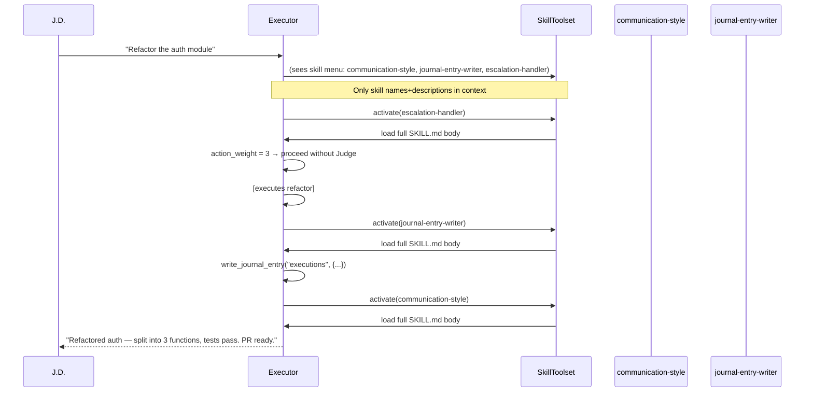

## Context

Phase 1 implemented the Trinity as minimal ADK agents. Each agent's entire capability is encoded in a single `instruction=` string passed at construction time. This means:
- Every interaction carries the full cognitive load of all instructions, even when only a fraction applies
- Adding a new capability requires editing the base prompt (fragile, merge-conflict-prone)
- The Judge's filter and collaborator modes already have different prompts — the natural next step is different *skill sets* per mode
- The Executor has no schema awareness for the journal, no platform formatting rules, no escalation protocol — all missing from the 11-line stub

ADK Skills (v1.25.0+, experimental) solve this via `SkillToolset`: a `BaseTool` subclass that exposes a menu of skills to the agent. Skills follow the [AgentSkills.io spec](https://agentskills.io/specification) — only `name` and `description` frontmatter load at startup (~100 tokens); the full body loads when the agent activates the skill; `references/` files load on demand. The context budget is preserved.

Research conducted by a 3-agent team (March 2026) identified 8 skills across the Trinity. The researcher agent confirmed: file-based skills are the right choice for Jarvis (auditable, evolvable, spec-compliant). The Dreamer/Judge designer and Executor designer produced full `SKILL.md` drafts for all 8 skills.

## Goals / Non-Goals

**Goals:**
- Wire `SkillToolset` into all 4 agent instances (dreamer, judge_filter, judge_collaborator, executor)
- Implement all 8 identified skills as file-based skill directories
- Establish `triforce/agents/<agent>/skills/` as the standard per-agent skill location
- Establish `triforce/skills/` as the shared cross-agent skill location
- Keep each `SKILL.md` under 300 lines (well within the 500-line limit)
- Pin `google-adk>=1.25.0` for Skills API compatibility
- Install `skill-creator` in `.claude/skills/` for future skill authoring

**Non-Goals:**
- Script execution in skills (`scripts/` directory not yet supported in ADK)
- Remote skill registry or skill versioning enforcement
- Dynamic skill loading at runtime (load at agent construction is sufficient)
- Skill hot-reload during a session (restart required to pick up new skills)
- `episodic-recall` skill implementation (waits for Phase 2 Mem0 integration — stub only now)

## Skill Architecture

```mermaid
graph TD
    subgraph Dreamer["🌙 Dreamer Agent"]
        DA["dreamer/agent.py\nSkillToolset"]
        DS1["reverse-assumption\n<i>SKILL.md</i>"]
        DS2["cross-domain-synthesis\n<i>SKILL.md + references/</i>"]
        DA --> DS1
        DA --> DS2
    end

    subgraph Judge["⚖️ Judge Agent (dual-mode)"]
        JF["judge_filter\nSkillToolset"]
        JC["judge_collaborator\nSkillToolset"]
        JS1["ethics-evaluation\n<i>SKILL.md + references/</i>"]
        JS2["belief-mutation\n<i>SKILL.md + references/</i>"]
        JS3["dream-deepening\n<i>SKILL.md</i>"]
        JF --> JS1
        JF --> JS2
        JC --> JS2
        JC --> JS3
    end

    subgraph Executor["⚡ Executor Agent"]
        EA["executor/agent.py\nSkillToolset"]
        ES1["communication-style\n<i>SKILL.md + references/</i>"]
        ES2["journal-entry-writer\n<i>SKILL.md + references/</i>"]
        ES3["escalation-handler\n<i>SKILL.md</i>"]
        EA --> ES1
        EA --> ES2
        EA --> ES3
    end

    subgraph Shared["🔗 Shared Skills\ntriforce/skills/"]
        SS1["episodic-recall\n<i>SKILL.md (stub)</i>"]
    end

    DA -.->|Phase 2| SS1
    JF -.->|Phase 2| SS1
    EA -.->|Phase 2| SS1

    style Dreamer fill:#1a1a2e,stroke:#e94560,color:#eee
    style Judge fill:#16213e,stroke:#0f3460,color:#eee
    style Executor fill:#0f3460,stroke:#533483,color:#eee
    style Shared fill:#0d1b2a,stroke:#533483,color:#eee,stroke-dasharray: 5 5
```



## Skill Activation Flow



## Directory Structure

```
triforce/
├── agents/
│   ├── dreamer/
│   │   ├── agent.py          (+ SkillToolset)
│   │   └── skills/
│   │       ├── reverse-assumption/
│   │       │   ├── SKILL.md
│   │       │   └── references/
│   │       │       ├── inversion-examples.md
│   │       │       └── assumption-taxonomy.md
│   │       └── cross-domain-synthesis/
│   │           ├── SKILL.md
│   │           └── references/
│   │               ├── domain-shape-library.md
│   │               └── translation-patterns.md
│   ├── judge/
│   │   ├── agent.py          (+ SkillToolset per mode)
│   │   └── skills/
│   │       ├── ethics-evaluation/
│   │       │   ├── SKILL.md
│   │       │   └── references/
│   │       │       └── ethics-rubric.md
│   │       ├── belief-mutation/
│   │       │   ├── SKILL.md
│   │       │   └── references/
│   │       │       └── ssgm-protocol.md
│   │       └── dream-deepening/
│   │           └── SKILL.md
│   └── executor/
│       ├── agent.py          (+ SkillToolset + write_journal_entry tool)
│       └── skills/
│           ├── communication-style/
│           │   ├── SKILL.md
│           │   └── references/
│           │       └── tone-examples.md
│           ├── journal-entry-writer/
│           │   ├── SKILL.md
│           │   └── references/
│           │       ├── schema-reference.md
│           │       └── entry-examples.json
│           └── escalation-handler/
│               └── SKILL.md
└── skills/                   (shared cross-agent)
    └── episodic-recall/
        └── SKILL.md          (stub — fully implemented in Phase 2)
```

## Decisions

### 1. File-based skills, not inline `models.Skill()`

**Choice**: All 8 skills are file-based (`load_skill_from_dir()`) following the AgentSkills.io spec.

**Rationale**: The Trinity is safety-critical. The Judge's belief-mutation and ethics-evaluation skills must be auditable by humans without reading Python source. File-based SKILL.md files are version-controllable, diffable, and validatable with `skills-ref`. Inline skills are convenient for prototyping but not for a production conscience.

### 2. Per-agent `skills/` subdirectory, not a global `triforce/skills/`

**Choice**: Each agent has its own `skills/` subdirectory. Only genuinely cross-agent skills go in `triforce/skills/`.

**Rationale**: Skill discovery is automatic (`iterdir()`). Per-agent directories make it obvious which agent owns which skill and prevents skills from leaking into wrong agents. `triforce/skills/` is reserved for skills that truly apply identically to all agents (only `episodic-recall` qualifies now).

### 3. Judge filter and collaborator get different skill subsets

**Choice**: `judge_filter` loads `ethics-evaluation` + `belief-mutation`. `judge_collaborator` loads `belief-mutation` + `dream-deepening`.

**Rationale**: Filter mode never needs dream-deepening. Collaborator mode never needs ethics-evaluation. Loading only relevant skills keeps context tight for each mode. `belief-mutation` is shared because both modes can mutate beliefs (filter after a high-weight decision, collaborator after a breakthrough).

**Implementation**: Two `SkillToolset` instances, one per agent. The simplest approach: two separate skills/ subdirectories (`skills-filter/` and `skills-collaborator/`) or conditional loading via the config.

### 4. `episodic-recall` is a stub now, fully implemented in Phase 2

**Choice**: Create the `episodic-recall` skill directory with a minimal SKILL.md stub that describes the protocol. Fully implement when Mem0 is integrated.

**Rationale**: The skill slot in each agent's `SkillToolset` should exist now so the agent knows episodic recall is *available*, even if the underlying Mem0 store isn't ready. The stub prevents the agent from improvising a different memory query approach.

### 5. Executor gets `write_journal_entry` tool added alongside SkillToolset

**Choice**: Add `write_journal_entry` from `journal_tools.py` to `executor_agent.tools` at the same time as SkillToolset.

**Rationale**: `journal-entry-writer` skill teaches *how* to write journal entries, but the agent needs the actual `write_journal_entry` tool to call. The skill and the tool are paired — one without the other is incomplete. This is a bug fix (the tool exists in `journal_tools.py` but was never added to the Executor's tool list).

### 6. AgentSkills.io spec compliance — only `name` and `description` in frontmatter

**Choice**: Only use `name` and `description` as YAML frontmatter keys (per spec). Additional metadata (scope, triggers, mode) goes in the SKILL.md body as documentation, not in frontmatter.

**Rationale**: The AgentSkills.io spec is clear: only `name`, `description`, `license`, `compatibility`, `metadata`, and `allowed-tools` are valid frontmatter keys. Custom keys like `scope`, `triggers`, `requires_tools` are not valid and may cause `skills-ref validate` to fail. Agent-specific context goes in the skill body.

### 7. `google-adk>=1.25.0` pin

**Choice**: Pin `google-adk>=1.25.0` in `pyproject.toml` (currently unpinned).

**Rationale**: The Skills API (`google.adk.skills`, `google.adk.tools.skill_toolset`) was added in v1.25.0 as an experimental feature. Without this pin, `pip install` might resolve an older version that lacks the API entirely, causing silent import errors at runtime.
