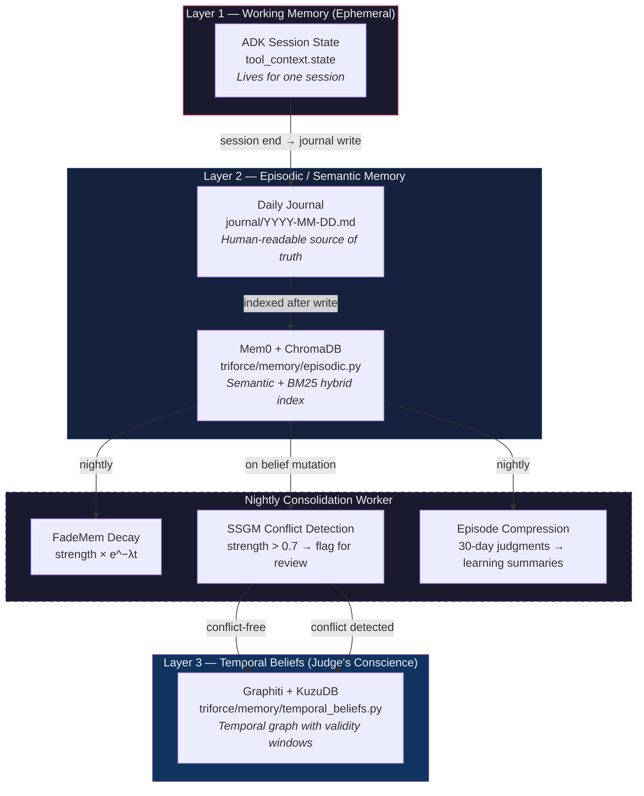
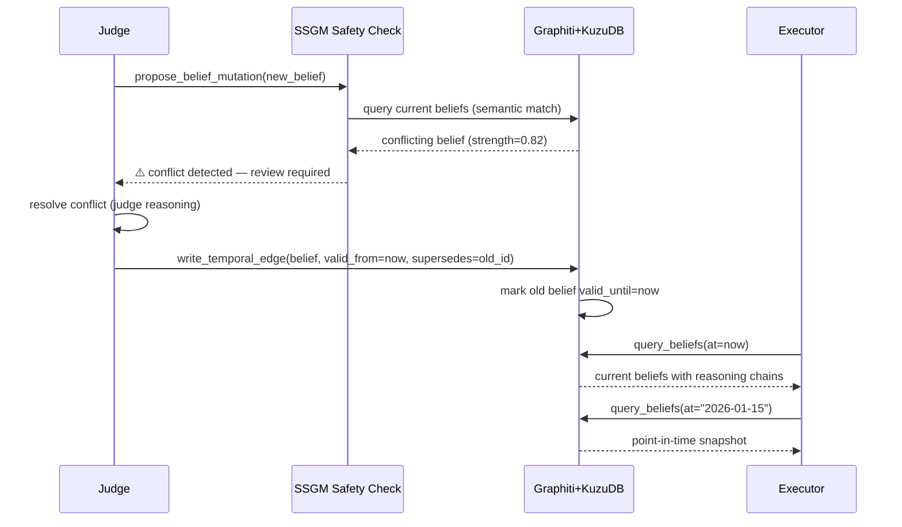
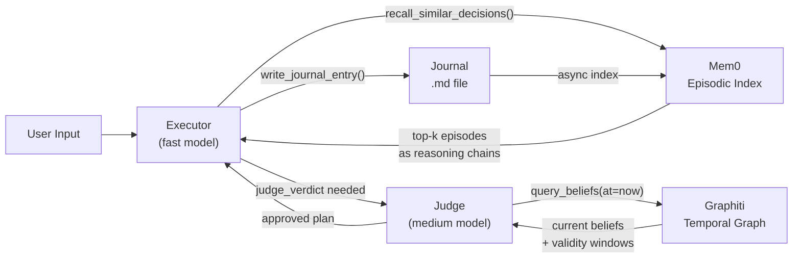

## Context

Phase 1 established the Trinity (Dreamer, Judge, Executor) as a running ADK multi-agent system with a file-based daily journal (`journal/YYYY-MM-DD.md`) and a flat JSON belief store (`memory/judge_beliefs.json`). These are sufficient for early experimentation but inadequate for a system that must learn and reason over time.

A 20-paper research survey (RESEARCH_MEMORY.md, March 2026) identified the precise gaps and the winning architecture. The core finding: **memory and retrieval are different problems**. The journal solves storage; this phase solves retrieval and temporal reasoning.

Key research inputs that shaped the architecture:
- **TiMem (Jan 2026)**: 3-tier hierarchy (raw events → episode summaries → long-term beliefs) with nightly consolidation beats "store everything + retrieve at query time" by 31% on long-horizon QA
- **Graphiti (2025)**: Only open-source framework with native temporal belief tracking — facts carry validity windows, enabling point-in-time queries
- **Mem0 (2025)**: Hybrid semantic + BM25 retrieval over episodic memory; 26% better than full-context on LOCOMO benchmark
- **SSGM (March 2026)**: Memory drift and belief poisoning are real systemic risks; conflict detection before overwrite is essential
- **FadeMem (Jan 2026)**: Ebbinghaus decay for agent memory — unused memories weaken, reinforced memories strengthen
- **ActMem (Feb 2026)**: Retrieved memories should be formatted as reasoning chains, not flat fact lists

## Goals / Non-Goals

**Goals:**
- Implement Mem0 episodic index over the daily journal with hybrid retrieval
- Implement Graphiti + KuzuDB temporal belief graph with point-in-time queries
- Add nightly consolidation worker with FadeMem decay and SSGM conflict detection
- Upgrade Judge tools to use the new memory backends
- Seed Dreamer and Executor working context from episodic memory at session start
- Maintain 100% local operation (Ollama for embeddings; no external API required)
- Keep the human-readable journal as the primary source of truth; new stores are indexes

**Non-Goals:**
- PageIndex reasoning-based RAG (evaluated and superseded by Mem0 hybrid retrieval)
- Fine-tuning or in-weights memory (out of scope for this architecture)
- Cloud-hosted vector databases (Pinecone, Weaviate, etc.) — local-first only
- Real-time streaming memory updates (batch indexing after write is sufficient)
- Multi-user or shared memory (Jarvis is a single-identity system)

## Architecture: 3-Layer Memory

## Belief Lifecycle (Temporal Graph)

## Memory Retrieval Flow (Awake Mode)

## Decisions

### 1. Mem0 over PageIndex for episodic retrieval

**Choice**: Use Mem0 (OSS) + ChromaDB embedded for the episodic index.

**Rationale**: PageIndex was the original recommendation (from RESEARCH.md) based on reasoning-based RAG. However, March 2026 research shows Mem0's hybrid semantic + BM25 retrieval achieves 26% better accuracy than full-context baseline on the LOCOMO benchmark, with 91% lower latency. PageIndex's tree-navigation approach adds latency that is acceptable for batch research but not for real-time Awake mode. Mem0 is purpose-built for agent episodic memory.

**Alternative considered**: PageIndex for journal navigation. Rejected — Mem0 better fits the operational retrieval pattern; PageIndex could still be used for research/reflection modes in a future phase.

### 2. Graphiti + KuzuDB over flat JSON for beliefs

**Choice**: Replace `memory/judge_beliefs.json` with a Graphiti temporal graph backed by KuzuDB (embedded).

**Rationale**: The flat JSON store has no concept of *when* a belief was true. Graphiti is the only open-source framework that natively tracks belief validity windows — essential for the Judge's self-mutation story ("I believed X, then I learned Y, so I now believe Z"). KuzuDB is embedded like SQLite — no server required.

**Alternative considered**: SQLite with timestamp columns. Rejected — lacks graph traversal semantics needed for belief dependency queries ("why does Jarvis believe X? → because it previously believed A and B, which led to C, which led to X").

### 3. Ollama-first embeddings with Gemini fallback

**Choice**: Default to Ollama (`nomic-embed-text` or `mxbai-embed-large`) for all embedding operations; Gemini API as optional upgrade.

**Rationale**: Local-first is non-negotiable for privacy and offline operation. Mem0 and Graphiti both support custom embedding functions. If `OLLAMA_HOST` is set, use Ollama; if `GOOGLE_API_KEY` is set and `EMBEDDING_BACKEND=gemini`, use Gemini.

### 4. SSGM conflict threshold at 0.7

**Choice**: Flag belief mutations when a new belief has cosine similarity > 0.7 with an existing belief of strength > 0.7.

**Rationale**: The SSGM paper (March 2026) identifies this threshold range as effective for catching genuine conflicts while avoiding false positives on related-but-distinct beliefs. Below 0.7, beliefs are considered orthogonal and can coexist.

### 5. FadeMem decay rate λ = 0.02/day

**Choice**: Use the Ebbinghaus decay equation `strength(t) = strength(0) × e^(−λt)` with λ = 0.02/day, reset on reinforcement.

**Rationale**: At λ = 0.02, a belief at full strength (1.0) drops to 0.37 after ~50 days without reinforcement — roughly 7 weeks, matching human episodic memory decay for infrequently recalled events. Reinforced beliefs reset the decay clock.

### 6. Journal remains the human-readable source of truth

**Choice**: Mem0 and Graphiti are indexes over the journal, not replacements. The `.md` files remain the authoritative record.

**Rationale**: The journal is readable by J.D. without any tools — it's introspectable, version-controllable (git), and portable. Losing the Mem0 or Graphiti store is recoverable by re-indexing from the journal. Losing the journal itself would lose everything.
