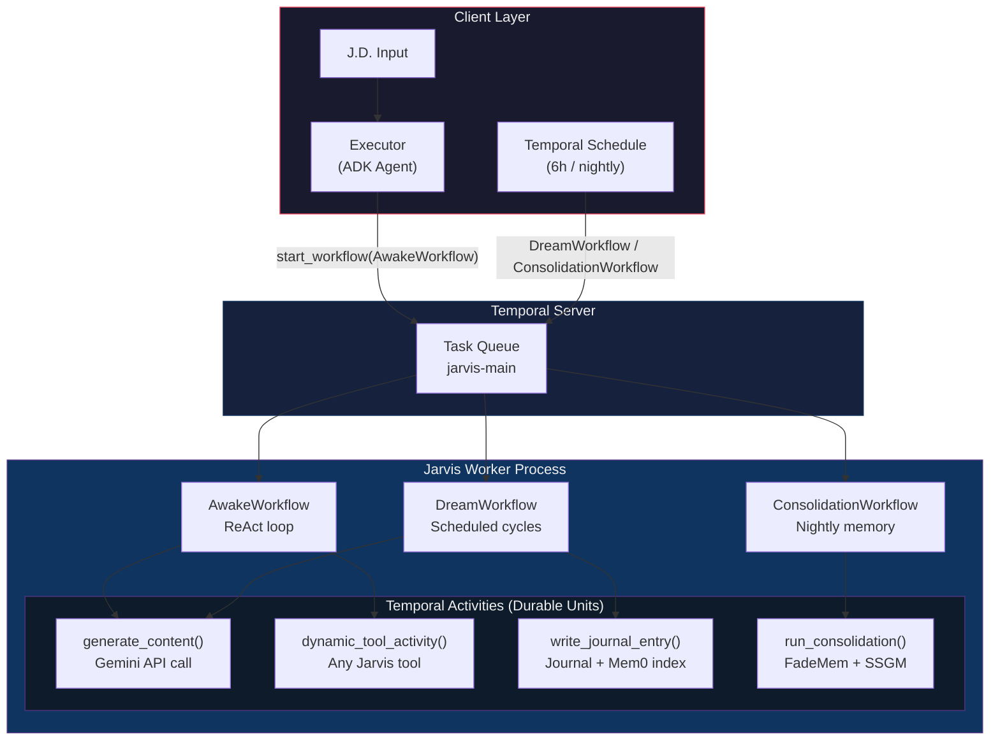
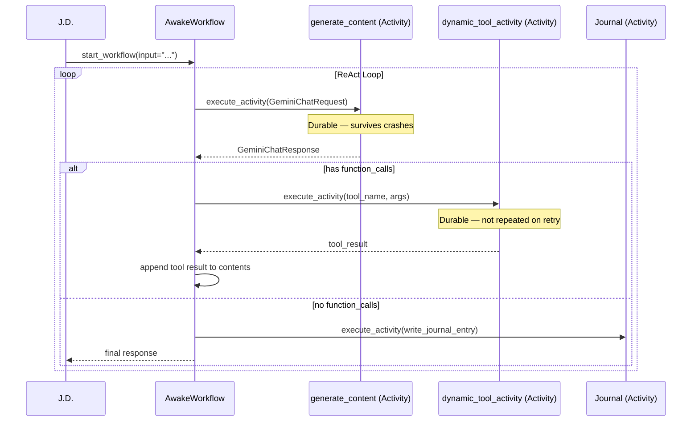
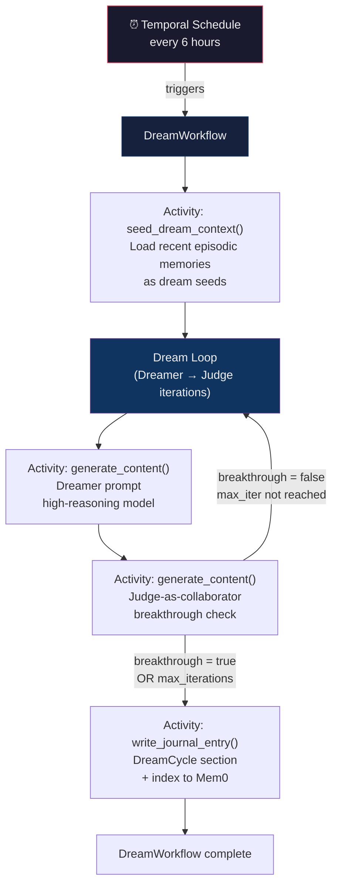

## Context

The Trinity (Phase 1) runs as an ADK multi-agent system. Temporal integration was listed as a Phase 3 goal in Phase 1's non-goals, and the `workflow.py` already demonstrates the `activity_as_tool()` bridge between Temporal and OpenAI Agents SDK. Phase 3 then focused on A2A distributed architecture. This change delivers the durable execution layer that was always part of the original vision — independent of A2A deployment.

Google's March 2026 tutorial ("Durable AI agent with Gemini and Temporal") provides a reference implementation that maps cleanly to Jarvis's needs. Key adaptation decisions: use Gemini directly (not OpenAI SDK) in the activities layer, map the ReAct loop to Jarvis's Awake mode, and extend to Dream cycles using Temporal Schedules.

The existing `workflow.py` is not replaced — it is extended. It already implements `activity_as_tool()` for Temporal + OpenAI Agents SDK. This change adds Gemini API support alongside it.

## Goals / Non-Goals

**Goals:**
- Implement durable Awake agentic loop as a Temporal Workflow (crash-safe, retry-safe)
- Implement Dreamer as a Temporal Scheduled Workflow (background cycles, no user prompting)
- Implement nightly consolidation as a Temporal Workflow (memory consolidation trigger)
- Adapt Google's `generate_content` and `dynamic_tool_activity` pattern to Jarvis
- Keep ADK-only operation working without Temporal (additive, not required for simple interactions)
- Local dev: `temporal server start-dev`; production-ready for Temporal Cloud

**Non-Goals:**
- Replacing ADK agents — Temporal is the durability layer, ADK is the agent orchestration layer
- Migrating `workflow.py`'s OpenAI Agents SDK bridge — extend it, don't replace it
- Temporal Nexus operations (too complex for this phase)
- Multi-worker deployment (single worker per agent tier is sufficient)
- UI or dashboard for Temporal workflows (use Temporal Web UI directly)

## Architecture: Temporal Durable Trinity

## Durable Awake Loop (ReAct Pattern)

## Dream Workflow (Temporal Schedule)

## Decisions

### 1. Gemini API directly in Activities (not via ADK)

**Choice**: Use `google-genai` SDK directly in `generate_content` Activity, following Google's tutorial pattern. Do not wrap ADK agents as Temporal Activities.

**Rationale**: ADK agents manage their own conversation loops internally — wrapping an entire ADK agent as a Temporal Activity would create a single monolithic activity that can't be checkpointed mid-conversation. The Google pattern makes each LLM call and each tool call a separate Activity, achieving true granular durability. ADK is used for agent *orchestration* and *routing*; Temporal activities handle durable *execution*.

**Alternative considered**: Wrap entire ADK `LoopAgent` as one activity. Rejected — no crash recovery within the loop; if iteration 7 of 8 crashes, all 7 are re-executed.

### 2. Automatic function calling disabled in activities

**Choice**: Set `automatic_function_calling=types.AutomaticFunctionCallingConfig(disable=True)` in the Gemini activity, following the Google tutorial.

**Rationale**: Automatic function calling combines the LLM call and tool execution into one opaque unit — neither is individually durable. Disabling it allows the workflow to handle each tool call as a separate Temporal Activity with its own retry policy, timeout, and heartbeat.

### 3. SDK retries disabled — Temporal owns retry logic

**Choice**: Set `retry_options=types.HttpRetryOptions(attempts=1)` in the Gemini client. Temporal's `RetryPolicy` on each Activity handles retries.

**Rationale**: Double-retry (SDK + Temporal) causes unpredictable behavior — a failed call might be retried twice by the SDK before Temporal even knows it failed. Single ownership of retry logic is simpler and more predictable.

### 4. ADK-only path preserved for short interactions

**Choice**: Short Awake interactions (simple Q&A, no multi-step plans) continue using ADK directly. `AwakeWorkflow` is used only for interactions that trigger a multi-step Executor plan (action_weight >= 4).

**Rationale**: Starting a Temporal workflow has ~100ms overhead — acceptable for complex actions, unnecessary for a quick factual question. The Judge's `action_weight` score (already in Phase 1) is the natural routing signal.

**Implementation**: `root_agent.py` checks `action_weight` after Judge evaluation; if >= 4, routes to `AwakeWorkflow` via Temporal client; otherwise executes inline.

### 5. Dream schedule default: every 6 hours

**Choice**: `DreamWorkflow` runs on a Temporal Schedule with 6-hour intervals, configurable via `DREAM_INTERVAL_HOURS` env var.

**Rationale**: The README.md describes the Dreamer as running "like sleep cycles" — implying multiple cycles per day, not continuous. 6 hours gives 4 dream cycles per day, aligned with human sleep cycle research (90-min NREM/REM cycles × 4–6 per night). Configurable for power-user adjustment.

### 6. `workflow.py` extended, not replaced

**Choice**: The existing `workflow.py` (`activity_as_tool()` bridge for OpenAI Agents SDK) is extended with Gemini-specific activity helpers, not replaced.

**Rationale**: The OpenAI bridge may be needed for Phase 3 A2A or tool integrations that use the OpenAI SDK. Keeping it avoids a breaking change. New Gemini activities are added as separate functions in `triforce/temporal/activities.py`.
